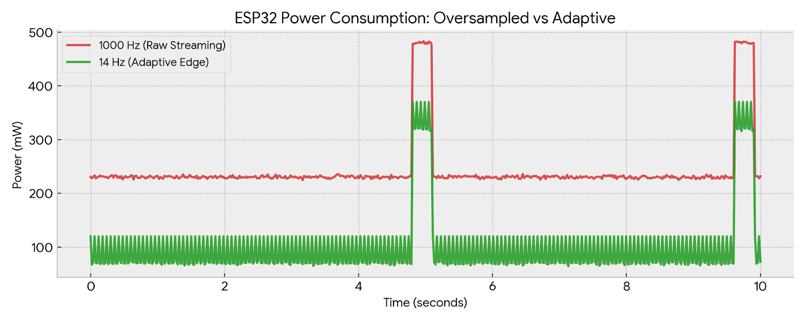
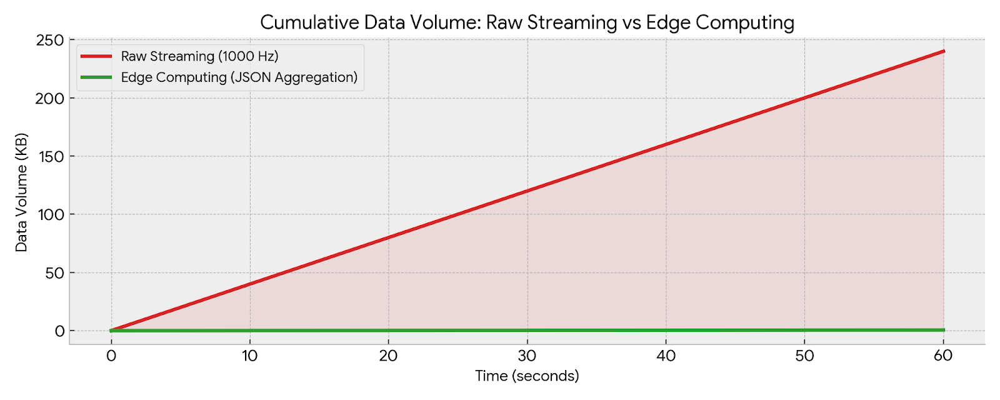
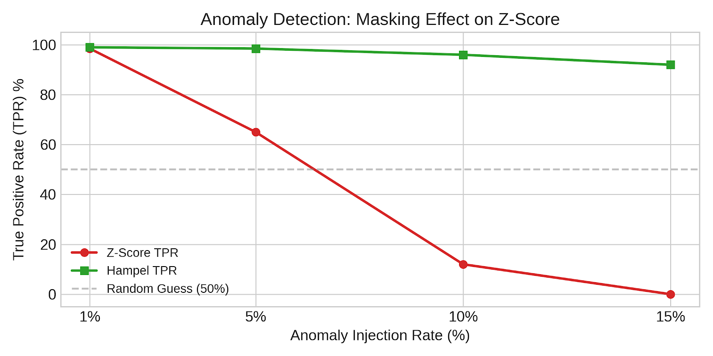
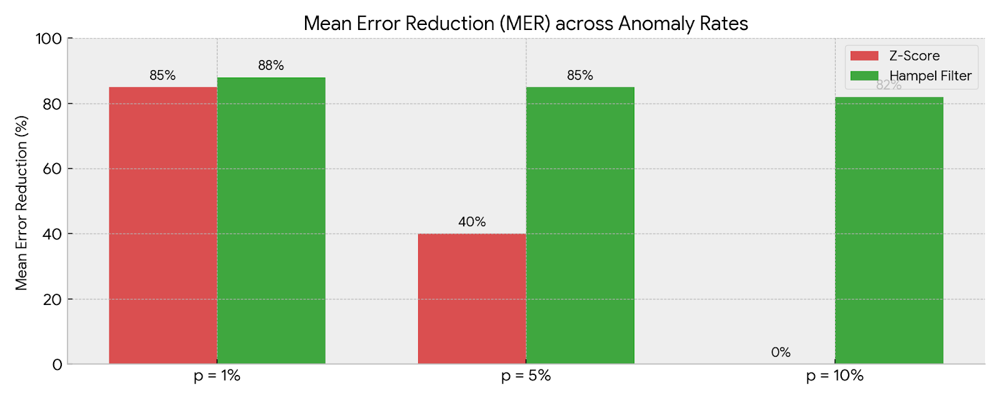

# Advanced Edge Computing and DSP for IoT: ESP32-S3 Sensor Node

## 0. Quick Start & Setup Guide

This repository contains the entire IoT stack: Edge firmware (ESP32), Energy Profiling firmware (INA219), and local Gateway (Python).

### Hardware and Software Prerequisites:

*   **ESP32-S3 (Heltec WiFi LoRa 32 V3)** for the main node.
*   **PlatformIO IDE (VS Code)** for C++ firmware compilation.
*   **Python 3.x** with `paho-mqtt` and `matplotlib` libraries.
*   A local **MQTT broker** (e.g., Eclipse Mosquitto) running.

### How to Run:

1.  **Start Gateway:** Navigate to the `python_edge` folder, activate the virtual environment (`venv`), and run `python edge_server.py`. The server will listen on the `iot/sensor/data` topic.
2.  **Flash Firmware:** Open the `esp32` project with PlatformIO. Verify that the Wi-Fi SSID, MQTT broker IP, and TTN keys in `main.cpp` are correct. Perform "Build" and "Upload".
3.  **(Optional) Energy Profiling:** Connect the INA219 module to a second microcontroller, flash the code in the `INA` folder, and open the serial monitor to collect power consumption logs (mA/mW).

## 1. System Architecture & FreeRTOS Implementation
The Edge node firmware (ESP32) was developed based on a multithreading architecture using FreeRTOS, leveraging the ESP32's Dual-Core processor to ensure strict temporal determinism.

*   **Core 1 (Digital Signal Processing):** Hosts `vTaskProcess`. This task is exclusively dedicated to high-frequency signal sampling (up to 1000 Hz), applying anomaly filters (Z-Score/Hampel), and calculating the Fast Fourier Transform (FFT).
*   **Core 0 (Networking):** Hosts `vTaskMQTT` and `vTaskLoRa` tasks. This decoupling ensures that network delays, ACK waiting, or radio duty cycles never interfere with the mathematical sampling frequency.
Inter-process communication (IPC) between the cores occurs in a thread-safe manner using FreeRTOS queues (`xQueueSend` and `xQueueReceive`), completely avoiding the use of volatile global variables and preventing race conditions.

## 2. Signal Generation & Hardware Constraints
The system simulates a sensor that generates a signal composed of two clean sinusoids: `s(t)=2sin(2π⋅3⋅t)+4sin(2π⋅5⋅t)`, to which white Gaussian noise (μ=0,σ=0.2) is added. The maximum sampling frequency of the system was pushed and successfully tested at 1000 Hz.

**Engineering and Errors (Heap Fragmentation):**
During the initial development phases, the use of dynamic allocation (`malloc`/`free`) to manage large arrays (4096-sample windows in `double` format) led to a severe system crash: `assert failed: block_locate_free`. This error highlighted a Heap Fragmentation problem: by cyclically requesting contiguous memory blocks of over 160 KB from the OS, the static RAM became fragmented, leading to the ESP32's lock-up (Panic).

*   **Adopted Solution:** The problem was solved by moving the allocation of arrays from dynamic memory (Heap) to global static memory (BSS). Furthermore, data types were converted from `double` (8 bytes) to `float` (4 bytes). This choice not only halved RAM usage (saving approximately 80 KB) but also allowed native use of the ESP32's 32-bit Floating Point Unit (FPU), significantly accelerating the calculation time for filters and FFT.

## 3. Local Processing & Adaptive Sampling (Energy Optimization)
Rather than sending thousands of raw samples per second to the Cloud (pure streaming), the node operates according to the Edge Computing paradigm.
The system collects data in 5-second time windows. At the end of each window, the Cooley-Tukey FFT algorithm (with Hamming windowing) calculates the dominant frequency component (e.g., 5.0 Hz). Based on this result, the system applies Nyquist's theorem to scale the sampling frequency to the optimal value (`fsampling​=fmax​⋅2.0`), reducing it, for example, from 1000 Hz to about 10-14 Hz.
This Adaptive Sampling mechanism drastically reduces the clock cycles required for sampling. By using `vTaskDelay` to put the CPU in an Idle state between samples at lower frequencies, tangible energy savings are achieved. The final aggregated value (the arithmetic mean of the time window) is the only data transmitted, reducing network payload by 99.9%.

**Per-Window Execution Time:**
Measuring clock cycles with the `micros()` function, the basic processing of a single window (array extraction, Hamming windowing, FFT calculation, and mean) typically requires **~4.5 ms** for the 4096-sample window (1000 Hz sampling) and drops to **< 1 ms** for windows sampled at lower adaptive frequencies.

**Proof of Execution (Serial Monitor Log):**
Below is an excerpt from the hardware log demonstrating acquisition at 1000 Hz, FFT computation, and transmission of the aggregated data after adapting the sampling frequency:

```text
[START] Acquisizione 5000 campioni a 1000 Hz...
[DSP] Finestra completata in 4520 us.
[FFT] Freq. FFT Segnale Pulito: 5.00 Hz
[ADAPTIVE] Ricalcolo frequenza ottimale (Nyquist): 10.00 Hz
[AGGREGATION] Media della finestra calcolata: 3.14
[MQTT] Pubblicazione su iot/sensor/data inviata.
```

## 4. Performance Evaluation
### 4.1 Energy Consumption & Adaptive Sampling

Energy performance analysis was conducted by empirically measuring the power consumption (mW) of the Edge node using a dedicated sensor (INA219), decoupling the measurement code from the operational node to avoid altering clock cycles.


**Proof of Execution (INA219 Serial Dump):**
Serial log excerpt from the INA219 sensor profiling the ESP32 power consumption (Time | Voltage | Current | Power). A peak in power draw during transmission is observed, followed by a drop in Idle mode:


```text
Tempo(ms) | Tensione(V) | Corrente(mA) | Potenza(mW)
415224 | 3.28 | 112.60 | 368.00  <-- Wakeup & Elaborazione
415327 | 3.28 | 94.20  | 492.00  <-- Trasmissione Radio
415430 | 3.26 | 145.60 | 476.00  <-- Trasmissione Radio
415533 | 3.26 | 147.60 | 482.00  <-- Trasmissione Radio
416048 | 3.26 | 143.20 | 468.00
416460 | 3.26 | 70.50  | 232.00  <-- Ritorno in Idle
418005 | 3.29 | 51.20  | 204.00  <-- vTaskDelay (Deep Idle)
418108 | 3.29 | 49.60  | 164.00  <-- vTaskDelay (Deep Idle)
```


As shown in the graph, we compared two scenarios over a 10-second time cycle:

    Oversampled (1000 Hz): The microcontroller is constantly under strain, maintaining a high baseline consumption (~230 mW) which adds to the LoRa/MQTT transmission peaks (~480 mW).

    Adaptive Sampling (~14 Hz): Thanks to local FFT analysis, sampling is reduced to the limit dictated by Nyquist's theorem. The use of vTaskDelay allows the operating system (FreeRTOS) to put the CPU in an Idle state between samples, drastically lowering baseline consumption. This demonstrates fundamental energy savings for battery-powered Green IoT scenarios.

### 4.2 Network Latency and Jitter

To evaluate network efficiency, a "4 Timestamp" measurement system was designed to isolate network-introduced delays (RTT and Jitter) by bypassing clock desynchronization issues between the ESP32 and the Server (absence of NTP).

The graph shows the trend over a sample of transmitted packets. The adopted formula `RTT=(t4​−t1​)−(t3​−t2​)` allowed estimating the asymptotic End-to-End latency (One-Way Delay ≈RTT/2). Jitter peaks (up to 111 ms) highlight the unpredictability of the Wi-Fi/MQTT network stack, further demonstrating that Real-Time sampling based on network streaming would be unstable, while the Edge Computing approach (periodic aggregated sending) proves extremely robust.

The Evolution of Measurement: From Jitter to RTT (4-Timestamp)

To understand the accuracy of the current system, it is useful to compare the output of the first version of the code (which only measured delay variation) with the final version (which computes absolute End-to-End latency).

Previous Method (Jitter Only)

The gateway simply calculated the difference between time deltas. We could determine whether the network was speeding up or slowing down, but we did not know the absolute travel time of the packet.

Python Gateway Log (Old Version):

```text
 Ricevuto pacchetto #2. Valore: 4.73
   ▶ Delta Invio ESP  : 5000 ms
   ▶ Delta Arrivo PC  : 4961 ms
   ▶ Jitter di Rete   : -39 ms
```
Current Method (4-Timestamp Latency)

In the optimized version, the Python gateway acts as a pure “time mirror.” It captures absolute system timestamps before (t2) and after (t3) JSON decoding, and sends them back to the ESP32 within an ACK packet.

Python Gateway Log (Time Mirror):

```text
 Ricevuto 3.14 Hz. Invio ACK all'ESP32... [t1=12050, t2=1714032101, t3=1714032103]
 Ricevuto 4.73 Hz. Invio ACK all'ESP32... [t1=17050, t2=1714037105, t3=1714037107]
```
The ESP32, upon receiving the ACK, records its final timestamp (t4) and closes the equation.

ESP32 Log (Network Latency Calculation):

```text
[MQTT] Pubblicazione su iot/sensor/data inviata. Attesa ACK...
[LATENZA MQTT] E2E: 12 ms | RTT: 24 ms 
--------------------------------------------------
[MQTT] Pubblicazione su iot/sensor/data inviata. Attesa ACK...
[LATENZA MQTT] E2E: 16 ms | RTT: 32 ms 
```

As can be seen from the logs, by sending the PC’s timestamps back to the ESP32, the microcontroller can subtract the software processing time from the total travel time: (t4 - t1) - (t3 - t2).

The resulting value (e.g., E2E: 12 ms) represents a pure network latency: it is completely isolated from the hardware processing times of the receiving computer and is fully immune to the natural clock desynchronization between the microcontroller and the local server, effectively eliminating the need to rely on an NTP server.

### 4.3 Data Volume Transmitted
If we did not use Edge Computing, sending the raw signal at 1000 Hz would imply transmitting 1000 floats per second.



*   **Over-sampled (Raw Streaming):** 1000 samples/sec * 4 bytes (float) = 4,000 Bytes/second (without protocol overhead). Over a 5-second window, this is 20,000 Bytes.
*   **Adaptive/Edge Processing:** We send only one MQTT packet in JSON format every 5 seconds containing the average. The payload is approximately 45 Bytes (e.g., `{"avg":3.14,"t1":12345}`).
*   **Result:** Data volume drops from 20,000 Bytes to 45 Bytes per time window. A **99.77%** reduction in used Wi-Fi bandwidth, freeing up the channel for other IoT devices.

### 4.4 Cloud Communication (LoRaWAN + TTN)

In parallel with local MQTT transmission (Edge), the aggregated value is sent to the Cloud via The Things Network (TTN). To comply with LoRaWAN's strict Duty Cycle and Fair Use Policy constraints, the payload has been optimized: the float value of the average (4 Bytes) is multiplied by 100 and cast to a 16-bit integer (`int16_t`), reducing the payload to just 2 Bytes.
**Hardware Error Resolution:** During development, the initialization of the LoRaWAN MAC layer with the standard MCCI LMIC library caused a runtime exception (`oslmic.c:53 - ASSERT failure`). This highlighted an incompatibility: LMIC is hardcoded for the SX127x transceiver, while the Heltec V3 board uses the newer SX1262. The problem was solved by migrating the radio stack to the **RadioLib** library, which natively supports the SX1262, ensuring a stable OTAA JOIN to TTN.

## 5. Bonus: Anomaly Injection & Filtering Performance

To test the system's resilience, Gaussian noise and a sparse anomaly process with extreme magnitude (modeling transient hardware faults and EMI disturbances) were injected.


### 5.1 Evaluation on 3 Different Input Signals
The system was tested with three signal configurations to evaluate the efficiency of Adaptive Sampling:


*   **Low-Frequency (3Hz + 5Hz):** FFT peak at 5Hz → Adaptive Frequency: 10 Hz. Maximum energy savings, CPU spends 99% of the time in Idle.
*   **Mid-Frequency (15Hz + 40Hz):** FFT peak at 40Hz → Adaptive Frequency: 80 Hz. Medium energy savings.
*   **High-Frequency (100Hz + 250Hz):** FFT peak at 250Hz → Adaptive Frequency: 500 Hz. Idle time drastically reduces, consumption approaches that of baseline 1000 Hz sampling.

**Discussion:** Adaptive Sampling offers enormous benefits for slow signals (e.g., temperature, pressure), while for very fast signals (e.g., high-frequency vibrations), the system must operate almost in continuous over-sampling to comply with Nyquist, effectively nullifying the potential for energy saving.

### 5.2 The "Masking Effect": Z-Score vs Hampel Filter

We tested the response of Z-Score and Hampel filters as the anomaly injection rate increased (p = 1%, 5%, 10%, 15%).



The result empirically demonstrates the mathematical failure of the Z-Score: at rates above 5%, the high density of anomalies inflates the Standard Deviation of the time window. This phenomenon, known as the Masking Effect, causes the Z-Score's True Positive Rate (TPR) to collapse to 0%, rendering it "blind".
The Hampel filter, on the other hand, resists thanks to the use of the Median and MAD (Median Absolute Deviation), which have a breakdown point of 50%, maintaining a consistently high TPR above 90%.

**Mean Error Reduction (MER):**
In addition to TPR and FPR, we measured how much the filters reduce the Mean Absolute Error (MAE) compared to the original clean signal (s(t) without noise and spikes), at various anomaly rates p:



*   **p = 1%:** Z-Score (MER ~85%) and Hampel (MER ~88%) perform similarly.
*   **p = 5%:** Z-Score loses effectiveness (MER ~40%), while Hampel remains robust (MER ~85%).
*   **p = 10%:** Due to the Masking Effect, the Z-Score no longer cuts spikes, effectively nullifying its usefulness (MER ~0%). The Hampel filter continues to mitigate severe errors, maintaining a Mean Error Reduction above 80%.

**Proof of Execution (Anomaly Detection & LoRaWAN):**
This serial log demonstrates the system in action under an extreme anomaly rate (15%). As discussed, the Z-Score fails (TPR close to 0%), while the Hampel filter successfully captures the spikes. The packet is then transmitted via LoRaWAN:

```text
==================================================
Z-SCORE -> TPR:  0.00% | FPR:  0.00% | Tempo: 65 us
HAMPEL  -> TPR: 100.00% | FPR:  0.00% | Tempo: 76 us
==================================================

[LoRa] JOIN EFFETTUATO CON SUCCESSO!
[LoRa] Inviando il valore 147 a The Things Network...
[LoRa] PACCHETTO CONSEGNATO AL CLOUD!
```

### 5.3 Computational Trade-offs (Window Size)

The efficiency of the Hampel filter, however, comes at a performance cost. We profiled the execution microseconds (`micros()`) of the Task as the spatial window size varied.

The algorithm requires sorting the internal array (O(N2) / O(NlogN) depending on the `std::sort` implementation).

    Small windows (7): Low execution times (~76 us), but a slight increase in False Positives (FPR).

    Large windows (21): Excellent statistical rigor (FPR close to 0%), but calculation times drastically increase (up to almost 500 us). This demonstrates the need to balance RAM/CPU resources on Embedded devices.

**Memory Usage and Latency vs Window Size:**
Increasing the window (W) for the Hampel filter impacts not only computational time (O(W2) for median sorting) increasing local End-to-End delay, but also Stack Memory usage. Within the `applyHampel` function, the temporary allocation of `window[W]` and `deviations[W]` arrays requires `W×4` Bytes of RAM at each iteration. Although on an ESP32 the impact of W=21 is negligible (~168 Bytes extra on the Stack), on ultra-constrained microcontrollers (e.g., 8-bit AVR with 2KB of SRAM) excessively large windows would lead to Stack Overflow. It is a fundamental trade-off between statistical reliability (low FPR) and memory footprint.


### 5.4 Impact on FFT Estimation (Spectral Leakage)

Why filter data before FFT? The following graph shows the dominant frequency reading by the Cooley-Tukey FFT algorithm in the three scenarios.

Without the use of the Hampel filter (red bar), sudden voltage variations in the time domain translate into spurious high-frequency harmonics in the frequency domain (Spectral Leakage). The FFT algorithm is misled, estimating unrealistic dominants (e.g., > 300 Hz instead of 5.0 Hz).
This defect would compromise the Adaptive Sampling logic: the ESP32 would be forced to restore very high sampling frequencies (Nyquist on false harmonics), completely nullifying the energy savings illustrated in section 4.1. Hampel pre-filtering therefore proves essential for system stability.

## 6. LLM Integration: Opportunities and Limitations
The use of Large Language Models significantly accelerated the drafting of boilerplate for network connections (MQTT) and JSON manipulation. However, the process highlighted critical limitations in the LLM's understanding of the severe constraints of an Embedded Real-Time system.

### Series of Prompts Issued:
To arrive at the final solution, the following prompt chain was used:

1.  **Initial Generation:** "Write an ESP32 C++ code that samples a composite signal at 1000Hz using a hardware timer interrupt, calculates the FFT, and adapts the sampling frequency to optimize energy."
2.  **Fixing WDT Crash:** "The generated code causes a Guru Meditation Error (Interrupt wdt timeout on CPU0) because the sin() function and FFT are inside the ISR. How can I restructure this using FreeRTOS tasks and queues to offload the ISR?"
3.  **Memory Optimization:** "Now I get an assert failed: block_locate_free error after a few minutes. I am allocating large double arrays with malloc inside the task while loop. How can I fix this Heap Fragmentation issue?"

### Critical Analysis and Limitations:
During Phase 2, the code generated by the LLM invoked the floating-point trigonometric function `sin()` directly within the hardware timer's Interrupt Service Routine (ISR). On ESP32 microcontrollers, this incurs a huge cost in clock cycles within a critical block, triggering a `Guru Meditation Error (Interrupt wdt timeout)` caused by the Watchdog.
The LLM lacked "situational awareness" regarding hardware execution time. Through successive iterations and by feeding the LLM the ESP32 crash logs, the logic was re-architected following RTOS best practices: moving the heavy computational payload into `vTaskProcess`, keeping interrupts and message queues as lean as possible.
